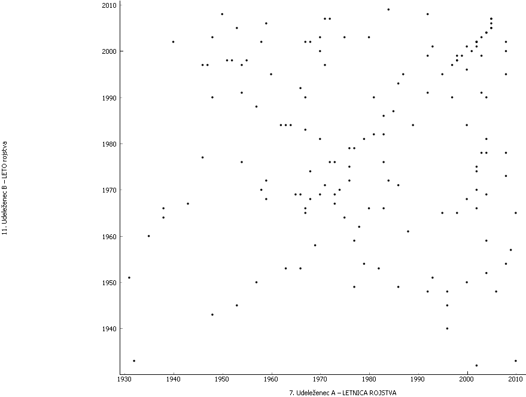

# Smučarske nesreče 2013-2016

Podatki so osnovni podatki , ponesrečene 1, 2 , drugi podatki.

Temperatura presega čez 30°C in tudi pod -30°C to se zdi za ta leti čas preveč zato jih bo treba odstraniti.

Veliko podatkov je zapisanih z številom in besedilom , drugi pa imajo samo število ali samo besedilo to bo treba odpraviti

Nekatera polja imajo znak / oz nekaj neznanega to bi bilo terba odstraniti.

Nekateri ponesrečenci se še niso rodili... ali pa so rojeni leta 1000

Čase bi bilo dobro spremeniti v 30-15 min intervale.

#### Opažanja

<ul>
  <li>Največ poškodb od 9:30 - 16:00 vendar je med 12:30 in 13:40 malo manj poškodb verjetno zaradi kosila in malice ob 10:30-10:50.</li>
  <li>Starejši od 30 imajo večjo možnost hujše poškodbe?</li>
  <li>Mlajši se medseboj več zaletavajo oz je vsaj 1 mlad bil prisoten pri trku (mlajši do 25-30 let?)</li>
</ul>

Podatke je potrebno veliko še obdelati da bodo primernejši.

