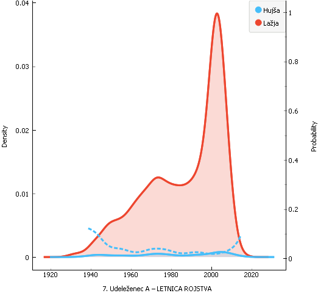
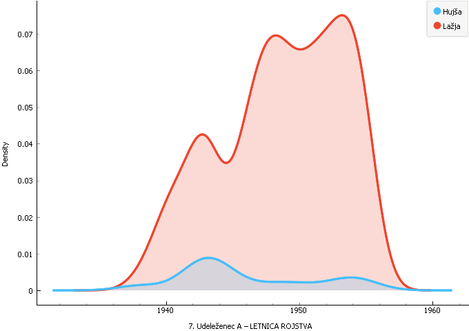
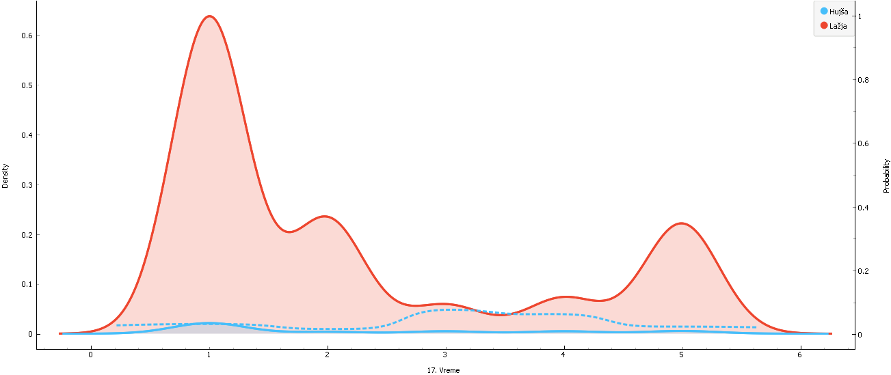
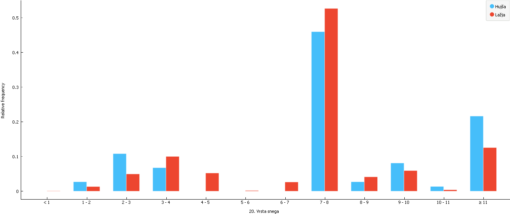
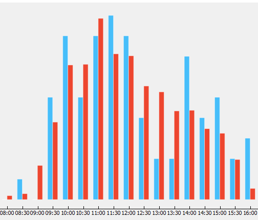

# Smučarske nesreče v sloveniji(2013-2016)
Podatki v datoteki so:
```
Datum nesreče Ura nesreče, Udeleženec LETNICA ROJSTVA, Udeleženec država, Udeleženec ravnanje pred nesrečo,
Vreme, Vidljivost, Temperatura, Vrsta snega, Veter,
Telesna poškodba
in še.
```

###### Spremembe na podatkih
```
Temperatura nad 40°C in pod -40°C sva odstranil iz podatkov.
Veliko podatkov je bilo zapisanih z številom in besedilom , drugi pa imajo samo število ali samo besedilo to sem odpravil da sva postavil samo števila
Nekateri ponesrečenci so bili rojeni leta 1000 sva jih popravil oz odstranil (bila sta 2)
Čase sva spremenila v 30 min intervale.
```


#### Opažanja
<div>
<ul>
  <li>Starejši od 30 imajo večjo možnost hujše poškodbe?</li>
  <li>Mlajši se medseboj več zaletavajo oz je vsaj 1 mlad bil prisoten pri trku (mlajši do 25-30 let?)</li>
</ul>
</div>
Pri pogledu na to sliko opazimo da je nesrež izredno veliko men maljšimi (oz neiskušenimi). Hujše poškodbe zelo počasi narašajo. Slika kaše da mlajši je večjo šanso ima da se huje poškoduje vendar predvidevam da to samo zaradi pomankanjo podatkov v tistih letih.

Tukaj sem si bližje pogledal ljudi ki so smučali in so bili rojeni 40-60 , ker je zgledalo da se hitreje poškoduejo. Res je starejši se malo hitreje Hujše poškodujejo če se poškodujejo.


Ta graf prikazuje da se več Hujših nesreč zgodi ob spremembi vremena 3-4 rahlo, pretežno oblačno. Verjento zaradi spremembe svetlobe in človek ne opazi dovolj hitro da se je stemnilo.


Zelo trd in mehak sneg sta dokaj nevarna za Hujše poškodbe . Navaden-kompakten sneg pa je pričakovan sneg na smučičih


V pogled kdaj se dogaja naveč nesreč. največ nesreč se dogaja pred kosilo verjetno utrujenost in ljudje postajajo lačni in nestrpni. večina hujših nesreč se zgodi 10:00, 11:00-12:00, pogosto se pa zgodijo tudi po kosilu(14:00) nato pa se veliko ljudi začne odpravljati domov. Ob 16:00 je zelo veliko Hujših nesreč verjetno ker so smučišča bolj prosta in so hitrosti večje in manj svetlobe.


 #### Napovedovanje
 Napovedovanje kakšna poškodba bo je zelo težko ker sej večina (96.5%) poškodb lažjih.
 <table>
 <tr>
 <th>Method</th> <th>AUC</th> <th>CA</th><th>F1</th><th>Precision</th><th>Recall</th>
 </tr>
 <tr>
 <td>kNN</td><td>0.511</td><td>0.969</td><td>0.984</td><td>0.940</td> <td>0.969</td>
 </tr>
   <tr>
 <td>Random Forest</td><td>0.528</td> <td>0.970</td><td>0.985</td><td>0.940</td><td>0.970</td>
 </tr>
    <tr>
 <td>Naive Bayes</td> <td>0.492</td> <td>0.933</td> <td>0.965</td> <td>0.942</td> <td>0.933</td>
 </tr>
    <tr>
 <td>Logistic Regression</td> <td>0.543</td> <td>0.970</td> <td>0.985</td> <td>0.940</td> <td>0.970</td>
 </tr>
 </table>
 Bayes se je nabolje odrezal pri napovedovanju Hujših vendar povsod zelo slab nasploh 
 
 Nato sva poiskusila napovedovati temperaturo z poškodbam
<table>
 <tr>
 <th>Method</th> <th>MSE</th> <th>RMSE</th><th>MAE</th><th>R2</th>
 </tr>
  <tr>
 <td>kNN</td><td>44.226</td><td>6.650</td><td>4.208</td><td>-0.117</td> 
 </tr>
   <tr>
 <td>Random Forest</td><td>45.126</td> <td>6.718</td><td>4.184</td><td>-0.140</td>
 </tr>
 </table>
Kot vidite v tabeli je bilo neuspešno oz zelo nenatančo

Poiskusil sem napovedati vreme kar je bilo presentljivo natančo.
 <table>
 <tr>
 <th>Method</th> <th>AUC</th> <th>CA</th><th>F1</th><th>Precision</th><th>Recall</th>
 </tr>
 <tr>
 <td>kNN</td><td>0.537</td><td>0.477</td><td>0.460</td><td>0.461</td> <td>0.477</td>
 </tr>
   <tr>
 <td>Random Forest</td><td>0.654</td> <td>0.562</td><td>0.544</td><td>0.535</td><td>0.562</td>
 </tr>
    <tr>
 <td>Naive Bayes</td> <td>0.626</td> <td>0.435</td> <td>0.461</td> <td>0.546</td> <td>0.435</td>
 </tr>
    <tr>
 <td>Logistic Regression</td> <td>0.672</td> <td>0.575</td> <td>0.549</td> <td>0.541</td> <td>0.575</td>
 </tr>
 </table>
 
 Naučila sva se da tudi če imaš veliko atributov ni nujno da boš lahko napovedoval to kar hočeš oz. da lahko iz njih kaj lahko napoveduješ. Najverjetneje bi najlažje napovedovala vreme po zimi iz teh podatkov. 
